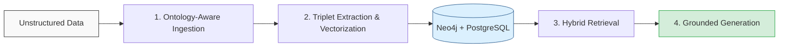

<div align="center">

# GRAG

**The Enterprise-Grade Multi-Tenant Graph RAG & Autonomous AI Platform**

[](#)
[](https://opensource.org/licenses/MIT)
[](#)
[](#)

*Transforming unstructured data into deterministic, actionable graph intelligence through Active Ontologies and Multi-Hop Traversals.*

</div>

---

## 🚀 What is GRAG?

GRAG is a state-of-the-art backend framework that bridges the gap between raw unstructured documents and autonomous AI reasoning by enforcing strict semantic schemas. 

While vanilla RAG pipelines struggle with relationship hallucinations and complex multi-hop queries, and standard graph databases lack semantic vector flexibility, GRAG unifies the two. By combining the deterministic structure of **Neo4j**, the semantic search capabilities of **pgvector**, and an **Active Enterprise Ontology** layer, GRAG ensures that AI agents interact with highly accurate, context-aware, and strictly isolated knowledge bases.

## 🎯 Who is this for?

GRAG is engineered for teams building complex, data-dense AI applications for production environments.

* **Enterprise Architects:** Struggling with relationship sprawl and data isolation. *Solution:* GRAG enforces rigid Row-Level Security (RLS) and Active Ontologies to prevent graph chaos and guarantee data silos.
* **AI/ML Developers:** Dealing with LLM hallucinations during multi-hop reasoning tasks. *Solution:* GRAG extracts semantic triplets that strictly adhere to a predefined blueprint, anchoring LLM generation in factual graph traversals.
* **Data Engineers:** Burdened by writing custom ingestion pipelines for disparate formats. *Solution:* GRAG provides an out-of-the-box multimodal ETL pipeline, automatically parsing PDFs, spreadsheets, and web pages into a unified graph structure.

## ✨ Core Capabilities & Features

* **Multi-Hop Reasoning (Graph Expansion):** Enables AI to traverse semantic paths and definitively answer complex relationship queries.
* **Explainable Retrieval (Attribution & Scoring):** Transparent sourcing and reasoning for every chunk injected into the LLM context.
* **Hybrid Vector + Graph Search:** Unifies `pgvector` semantic similarity with Neo4j structural edge traversals.
* **Dynamic Ontology Triplet Extraction:** Automatically infers and extracts `(Subject, Predicate, Object)` facts to build deterministic knowledge graphs.
* **Context Token Budgeting:** Greedy selection algorithm ensuring LLM context windows are never flooded with irrelevant noise.
* **Continuous Feedback Weighting:** Graph node and edge weights update dynamically based on user feedback for self-improving retrieval.
* **Multimodal Ingestion (PDF/Excel):** Built-in smart chunking and table extraction eliminating the need for external ETL middleware.
* **Multi-Tenant Isolation:** Zero-trust isolation enforced via PostgreSQL Row-Level Security (RLS) and strict Neo4j node constraints.
* **Graph Traversal Depth Limiting:** Scoped queries capped at configurable hop limits (e.g., 2 hops) to prevent exponential latency bloat during real-time generation.
* **Neo4j Composite Indexing:** Pre-indexed properties for `MERGE` operations drastically optimizing write performance and preventing full-graph scans.

### 🚧 Pending (To-Do List Roadmap)
* [ ] **Persistent Personal/Session Memory**
* [ ] **Generative LLM Integration** (DeepInfra activation)
* [ ] **True Semantic Vector Embeddings**
* [ ] **ANN Vector Indexing (HNSW)** for large-scale scaling
* [ ] **LLM-based high-accuracy Entity Extraction**
* [ ] **Advanced Query Decomposition / Routing**
* [ ] **In-Memory Graph Database Migration** (e.g., FalkorDB, Memgraph) to reduce write latency
* [ ] **Graph Size Calculator & Concurrency Limiter** for production agent deployments


## 🏗️ Architecture & Workflow

GRAG operates on a four-stage deterministic pipeline:



1. **Data Ingestion:** Documents (PDFs, CSVs) are parsed. The Semantic Schema Engine scans the content to infer the underlying enterprise blueprint.
2. **Graph Construction:** The LLM extracts facts as `(Subject, Predicate, Object)` triplets, strictly adhering to the registered ontology. Chunks are embedded via pgvector.
3. **Retrieval:** User queries trigger a hybrid search—fetching semantically relevant chunks while expanding structural boundaries through Neo4j relationships.
4. **Generation:** The context, alongside strict ontology rules, is injected into the prompt, forcing the Agent to reason deterministically.

## 🛡️ Security, Safety & Isolation

GRAG is designed from the ground up for zero-trust, multi-tenant enterprise environments.

* **PostgreSQL Row-Level Security (RLS):** All relational queries automatically append tenant context at the database engine level. Cross-tenant data leakage is cryptographically and structurally impossible.
* **Graph Isolation:** Every Node and Edge inside Neo4j carries a mandatory `tenant_id` constraint. Graph traversals cannot bridge isolated tenant clusters.
* **Stateless Auth:** Secure JWT-based authentication manages stateless sessions, allowing horizontal scaling without compromising access controls.
* **Strict Prompt Sandboxing:** System prompts enforce rigid persona bounds and ontology rules, drastically mitigating prompt injection and hallucination vectors.

## 🚦 Getting Started

Deploy GRAG locally using Docker. The environment spin-up is fully containerized.

```bash
# 1. Clone the repository
git clone https://github.com/GramosoftAI/GRAG.git
cd GRAG

# 2. Configure environment
cp .env.example .env
# Edit .env to add your DeepInfra API key and database credentials

# 3. Launch the infrastructure and API server
docker-compose up -d --build

# 4. Verify deployment (Hello GRAG)
curl -X GET "http://localhost:8000/api/v1/health" \
     -H "Accept: application/json"
# Expected Output: {"status": "healthy", "database": "connected", "graph": "connected"}
```

*The Swagger UI documentation is immediately available at `http://localhost:8000/docs`.*

## 🤝 Contributing

**Our Vision:** We believe the future of AI lies in deterministic, verifiable reasoning. GRAG is an open initiative to democratize enterprise-grade graph intelligence for developers everywhere.

We are building something significant, and your contributions matter. Whether you are optimizing a Cypher query, adding a new document loader, or fixing a typo, you are pushing the ecosystem forward.

* **Guidelines:** Please review our `CONTRIBUTING.md` for architecture details and PR formatting.
* **Issue/PR Process:** Check the issue tracker for `good first issue` tags. Fork the repo, create a feature branch (`feat/your-feature`), and open a Draft PR for early feedback.
* **Code of Conduct:** We enforce a strict standard of respect and inclusivity. See `CODE_OF_CONDUCT.md`.

Join us in building the standard for verifiable AI reasoning.

## 📜 License

This project is licensed under the **MIT License**. See the `LICENSE` file for details.

---
*Empowering deterministic AI through structured enterprise intelligence.*
