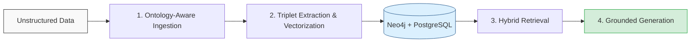

<div align="center">

# GRAG

### Open-Source Enterprise AI Search — a self-hosted, Graph RAG alternative to Glean, GoSearch, and Guru

**Turn scattered enterprise documents into deterministic, permission-aware, explainable answers — on your own infrastructure.**

[](#)
[](https://opensource.org/licenses/MIT)
[](#)
[](#-getting-started)
[](#-contributing)

*Graph RAG · Multi-Tenant · Self-Hosted · Permission-Aware · Explainable Retrieval*

</div>

---

> **GRAG is an open-source enterprise AI search and Graph RAG platform.** It connects unstructured company data — PDFs, spreadsheets, web pages — to a hybrid **Neo4j + pgvector** knowledge layer, so AI agents answer multi-hop questions with grounded, attributable, tenant-isolated results. If you've evaluated **Glean**, **GoSearch**, **Guru**, or **Onyx** and wanted a self-hostable, graph-native, MIT-licensed option you fully control, GRAG is built for you.

## 📑 Table of Contents

- [What is GRAG?](#-what-is-grag)
- [Why GRAG? (Open-Source Alternative)](#-why-grag-the-open-source-alternative)
- [GRAG vs Glean vs GoSearch vs Guru vs Onyx](#-comparison-grag-vs-the-market)
- [Who is this for?](#-who-is-this-for)
- [Core Capabilities](#-core-capabilities)
- [Architecture & Workflow](#-architecture--workflow)
- [RDF & Ontology Support](#-rdf--ontology-support)
- [Tech Stack](#-tech-stack)
- [Security & Multi-Tenant Isolation](#-security--multi-tenant-isolation)
- [Getting Started](#-getting-started)
- [Use Cases](#-use-cases--verticals)
- [Roadmap](#-roadmap)
- [FAQ](#-frequently-asked-questions)
- [Contributing](#-contributing)
- [License](#-license)

---

## 🚀 What is GRAG?

GRAG (**Gr**aph **R**etrieval-**A**ugmented **G**eneration) is a state-of-the-art backend framework for **enterprise AI search** that bridges raw unstructured documents and autonomous AI reasoning by enforcing strict semantic schemas.

Vanilla RAG pipelines hallucinate relationships and stumble on multi-hop queries; standard graph databases lack semantic vector flexibility. GRAG unifies both. By combining the deterministic structure of **Neo4j**, the semantic search of **pgvector**, and an **Active Enterprise Ontology** layer, GRAG ensures AI agents interact with accurate, context-aware, and strictly isolated knowledge bases — entirely on infrastructure you own.

**In one line:** the knowledge graph backbone for trustworthy, self-hosted enterprise AI search.

## 💡 Why GRAG? The Open-Source Alternative

The enterprise AI search market is dominated by powerful but **proprietary, SaaS-only** platforms. They index your data on someone else's cloud, price per seat, and keep the retrieval architecture closed.

GRAG takes the opposite stance:

- **🔓 Open Source (MIT):** No black box. Read, fork, audit, and extend every line of the retrieval pipeline.
- **🏠 Self-Hosted / On-Prem:** Your data never leaves your VPC. Critical for regulated industries (DPDPA, GDPR, aviation, finance, healthcare).
- **🕸️ Graph-Native (not vanilla RAG):** Active ontologies and multi-hop traversal deliver *deterministic, explainable* answers — not just nearest-neighbor vector guesses.
- **🏢 Built for Multi-Tenancy:** PostgreSQL Row-Level Security + Neo4j tenant constraints make GRAG a fit for MSPs, ISVs, and platforms serving many clients from one deployment.
- **💸 Zero License Fees:** Pay for infrastructure, not per-seat SaaS minimums.

## 📊 Comparison: GRAG vs the Market

| Capability | **GRAG** | Glean | GoSearch | Guru | Onyx |
|---|:---:|:---:|:---:|:---:|:---:|
| **License** | 🟢 Open Source (MIT) | 🔴 Proprietary | 🔴 Proprietary | 🔴 Proprietary | 🟢 Open Source |
| **Self-Hosted / On-Prem** | 🟢 Yes | 🟡 Limited | 🟡 BYOC | 🔴 SaaS only | 🟢 Yes |
| **Graph RAG (knowledge graph reasoning)** | 🟢 Native (Neo4j) | 🟡 Proprietary graph | 🔴 Federated | 🔴 Wiki-based | 🟡 Vector RAG |
| **Hybrid Vector + Graph Search** | 🟢 Yes | 🟡 Proprietary | 🟡 Yes | 🔴 No | 🟡 Vector only |
| **Active Ontology / Deterministic Triplets** | 🟢 Yes | 🔴 No | 🔴 No | 🔴 No | 🔴 No |
| **RDF / OWL / SKOS Standards Support** | 🟢 Yes (W3C) | 🔴 Proprietary | 🔴 No | 🔴 No | 🔴 No |
| **Multi-Tenant Isolation (RLS)** | 🟢 First-class | 🟡 Org-level | 🟡 Org-level | 🟡 Org-level | 🟡 Org-level |
| **Explainable Retrieval / Attribution** | 🟢 Per-chunk | 🟡 Citations | 🟡 Citations | 🟢 Citations | 🟡 Citations |
| **Pricing model** | 🟢 Free (infra cost) | 🔴 Premium | 🟡 Per-seat | 🟡 Per-seat | 🟢 Free (infra cost) |

> *Comparison reflects publicly available positioning of each platform and is intended as an architectural orientation, not an endorsement. Verify current vendor capabilities directly before procurement.*

## 🎯 Who is this for?

GRAG is engineered for teams building complex, data-dense AI applications for production environments.

- **Enterprise Architects** struggling with relationship sprawl and data isolation. → GRAG enforces rigid Row-Level Security and Active Ontologies to prevent graph chaos and guarantee data silos.
- **AI/ML Developers** fighting LLM hallucinations during multi-hop reasoning. → GRAG extracts semantic triplets that adhere to a predefined blueprint, anchoring generation in factual graph traversals.
- **Data Engineers** burdened by custom ingestion for disparate formats. → GRAG ships an out-of-the-box multimodal ETL pipeline, parsing PDFs, spreadsheets, and web pages into a unified graph.
- **MSPs / ISVs / Platform Teams** serving multiple clients. → One deployment, cryptographically-scoped tenant isolation, no per-tenant infrastructure sprawl.

## ✨ Core Capabilities

These capabilities are implemented in the current open-source release:

- **Multi-Hop Reasoning (Graph Expansion):** Traverse semantic paths in Neo4j to answer complex relationship queries.
- **Explainable Retrieval (Attribution & Scoring):** Transparent sourcing and reasoning for every chunk injected into the LLM context.
- **Hybrid Vector + Graph Search:** Unify `pgvector` similarity with Neo4j structural edge traversals in a single retrieval pass.
- **Ontology-Driven Triplet Extraction:** Extract `(Subject, Predicate, Object)` facts against a registered enterprise blueprint to build deterministic graphs.
- **Context Token Budgeting:** Greedy selection algorithm keeps LLM context windows free of irrelevant noise.
- **Continuous Feedback Weighting:** Node and edge weights update dynamically from user feedback for self-improving retrieval.
- **Enterprise-Grade Table Data Extraction:** Advanced analytical engine capable of accurately parsing dense, complex financial and operational tables with strict structural fidelity. This unlocks granular analytics and deterministic cross-table reasoning that standard OCR pipelines completely fail to capture.
- **Multimodal Ingestion (PDF / Excel / CSV):** Built-in smart chunking — no external ETL middleware required.
- **Multi-Tenant Isolation:** Zero-trust isolation via PostgreSQL Row-Level Security and Neo4j node constraints.
- **Graph Traversal Depth Limiting:** Scoped queries capped at configurable hop limits (e.g. 2 hops) to prevent latency bloat.
- **Neo4j Composite Indexing:** Pre-indexed `MERGE` properties optimize write performance and avoid full-graph scans.

> **A note on honesty:** GRAG ships a complete, runnable retrieval and ingestion pipeline today. Several *intelligence* layers — production-grade semantic embeddings, activated generative LLM responses, and LLM-grade entity extraction — are scaffolded and tracked on the [Roadmap](#-roadmap) below rather than overclaimed here. We'd rather you trust the README than be surprised by the code.

## 🏗️ Architecture & Workflow

GRAG operates on a four-stage deterministic pipeline:



1. **Data Ingestion:** PDFs, CSVs, and pages are parsed. The Semantic Schema Engine infers the underlying enterprise blueprint.
2. **Graph Construction:** Facts are extracted as `(Subject, Predicate, Object)` triplets adhering to the registered ontology; chunks are embedded via pgvector.
3. **Retrieval:** Queries trigger a hybrid search — fetching semantically relevant chunks while expanding structural boundaries through Neo4j relationships.
4. **Generation:** Context plus strict ontology rules are injected into the prompt, forcing the agent to reason deterministically.

## 🔗 RDF & Ontology Support

GRAG is built on **open semantic-web standards**, not a proprietary graph model. Its core unit of knowledge — the `(Subject, Predicate, Object)` triplet — is RDF by design. This means GRAG speaks the same language as the W3C linked-data ecosystem, so your enterprise knowledge graph stays portable, interoperable, and standards-compliant instead of locked into a vendor schema.

### Why RDF matters for enterprise AI search

- **Portability:** Triplets serialize to standard formats (Turtle, RDF/XML, JSON-LD, N-Triples). Your graph is never trapped inside GRAG.
- **Shared vocabularies:** Adopt established industry ontologies (e.g. SKOS taxonomies, OWL domain models for aviation or automotive) instead of reinventing a schema per client.
- **Determinism & validation:** A formal ontology is a contract. Extracted facts are checked against it, anchoring LLM output to a verifiable blueprint rather than free-form generation.
- **Interoperability:** RDF graphs federate. GRAG knowledge can be exchanged with other linked-data systems, triplestores, and knowledge-graph tooling.

### RDF concepts in GRAG

| RDF Concept | Role in GRAG |
|---|---|
| **Triple (S, P, O)** | The atomic fact unit extracted from documents and persisted to Neo4j. |
| **URI / IRI** | Globally unique, **tenant-scoped** identifiers for entities and predicates. |
| **Namespace / Prefix** | Compact vocabulary management across domains and tenants. |
| **Ontology (OWL/RDFS)** | The "Active Ontology" blueprint that constrains extraction. |
| **SKOS** | Taxonomy and concept-scheme support for hierarchical domain vocabularies. |
| **Literals & Datatypes** | Typed property values (dates, numbers, strings) on graph nodes. |

### Loading standard ontologies

GRAG integrates with [**rdflib**](https://rdflib.readthedocs.io/) and [**rdflib-neo4j**](https://github.com/neo4j-labs/rdflib-neo4j) (Neo4j Labs) to ingest standard RDF ontologies directly into the Neo4j knowledge layer — on both self-hosted and cloud Neo4j deployments. Load an OWL or SKOS file once, and GRAG anchors all downstream triplet extraction to that vocabulary.

```python
# Load a standard RDF/OWL/SKOS ontology into GRAG's Neo4j knowledge layer
from rdflib_neo4j import Neo4jStoreConfig, Neo4jStore, HANDLE_VOCAB_URI_STRATEGY
from rdflib import Graph

config = Neo4jStoreConfig(
    auth_data=auth_data,
    custom_prefixes=prefixes,                       # tenant + domain namespaces
    handle_vocab_uri_strategy=HANDLE_VOCAB_URI_STRATEGY.SHORTEN,
    batching=True,
)

graph = Graph(store=Neo4jStore(config=config))
graph.parse("ontologies/aviation-mro.ttl", format="ttl")   # OWL/SKOS/Turtle
graph.close(True)                                            # commit batched writes
```

> **Multi-tenancy note:** GRAG mints **tenant-scoped URIs** so that resources never collide across tenants. Uniqueness is enforced *within* a tenant boundary, preserving the zero-trust isolation guarantees described above while remaining RDF-compliant.

### On the RDF roadmap

The following deepen GRAG's semantic-web compliance and are tracked openly:

- [ ] **SHACL Validation** — enforce ontology shape constraints at ingestion time.
- [ ] **OWL/RDFS Inferencing** — derive implicit relationships (transitivity, subclass reasoning).
- [ ] **RDF / Turtle Export** — round-trip the graph back out to standard serializations.
- [ ] **SPARQL Query Endpoint** — query GRAG knowledge with the W3C standard graph query language.

## 🧱 Tech Stack

| Layer | Technology |
|---|---|
| **Graph Database** | Neo4j (native vector index + composite indexing) |
| **RDF / Ontology** | rdflib + rdflib-neo4j (OWL / SKOS / Turtle ingestion) |
| **Relational + Vectors** | PostgreSQL + pgvector |
| **API Layer** | FastAPI (Python) |
| **Auth** | Stateless JWT |
| **Orchestration** | Docker / Docker Compose |
| **LLM Inference** | DeepInfra-compatible (pluggable) |

## 🛡️ Security & Multi-Tenant Isolation

GRAG is designed from the ground up for zero-trust, multi-tenant enterprise environments.

- **PostgreSQL Row-Level Security (RLS):** Relational queries automatically append tenant context at the database engine level, making cross-tenant data leakage structurally impossible by design.
- **Graph Isolation:** Every Neo4j node and edge carries a mandatory `tenant_id` constraint; traversals cannot bridge isolated tenant clusters.
- **Stateless Auth:** JWT-based sessions enable horizontal scaling without compromising access controls.
- **Prompt Sandboxing:** System prompts enforce rigid persona bounds and ontology rules, mitigating prompt-injection and hallucination vectors.

## 🚦 Getting Started

Deploy GRAG locally with Docker. The environment spin-up is fully containerized.

```bash
# 1. Clone the repository
git clone https://github.com/GramosoftAI/GRAG.git
cd GRAG

# 2. Configure environment
cp .env.example .env
# Edit .env to add your DeepInfra API key and database credentials

# 3. Launch infrastructure + API server
docker-compose up -d --build

# 4. Verify deployment
curl -X GET "http://localhost:8000/api/v1/health" \
     -H "Accept: application/json"
# Expected: {"status": "healthy", "database": "connected", "graph": "connected"}
```

*Swagger UI documentation is available at `http://localhost:8000/docs`.*

## 🧩 Use Cases & Verticals

GRAG powers grounded, permission-aware search across data-dense industries:

- **✈️ Aviation MRO & Operations:** Multi-hop search across maintenance records, manuals, parts catalogs, and compliance docs — answer "which aircraft are affected by this airworthiness directive?" deterministically.
- **🚗 Automotive & Dealership Networks:** Unify service histories, parts inventories, and dealer documentation into a single queryable graph.
- **📑 Compliance & Regulatory Search:** Ground answers in circulars, policies, and audit trails with full attribution — built for DPDPA / GDPR-sensitive workloads.
- **🏭 Enterprise Knowledge Management:** Replace siloed wikis with a self-hosted, graph-native source of truth across SaaS exports and internal documents.

## 🗺️ Roadmap

Tracked, honestly. These convert GRAG's scaffolded intelligence layers into fully production-grade ones:

- [ ] **True Semantic Vector Embeddings** *(unlocks meaningful hybrid search)*
- [ ] **Generative LLM Integration** — DeepInfra activation *(unlocks live grounded generation)*
- [ ] **LLM-Based High-Accuracy Entity Extraction**
- [ ] **Persistent Personal / Session Memory**
- [ ] **ANN Vector Indexing (HNSW)** for large-scale scaling
- [ ] **Advanced Query Decomposition / Routing**
- [ ] **In-Memory Graph Migration** (FalkorDB / Memgraph) to cut write latency
- [ ] **Graph Size Calculator & Concurrency Limiter** for production agent deployments

> **Dependency chain:** real embeddings → LLM integration → LLM entity extraction are the three items that turn the "semantic" and "grounded generation" stages from architectural to fully functional.

## ❓ Frequently Asked Questions

**Is GRAG a free, open-source alternative to Glean?**
Yes. GRAG is MIT-licensed and self-hostable. Where Glean is a proprietary SaaS platform that indexes your data on its cloud, GRAG runs entirely on your infrastructure with full source access.

**How is GRAG different from Onyx (formerly Danswer)?**
Both are open-source and self-hostable. Onyx is primarily vector-based RAG; GRAG is **Graph RAG** — it adds a Neo4j knowledge graph and Active Ontology layer for deterministic, explainable multi-hop reasoning, plus first-class multi-tenant isolation.

**What is Graph RAG, and why does it matter?**
Graph RAG augments retrieval with a knowledge graph. Instead of returning isolated text chunks, it traverses relationships between entities — answering complex, multi-hop questions ("how does X relate to Y through Z?") that vanilla vector RAG cannot.

**Can GRAG serve multiple clients from one deployment?**
Yes. PostgreSQL Row-Level Security and Neo4j tenant constraints provide structural isolation, making GRAG suitable for MSPs, ISVs, and multi-tenant SaaS platforms.

**Does my data leave my servers?**
No. GRAG is self-hosted. The only external call is to your chosen LLM provider — and you control that endpoint.

**Does GRAG support RDF and standard ontologies?**
Yes. GRAG's `(Subject, Predicate, Object)` triplet model is RDF-native, and it integrates with rdflib and rdflib-neo4j to load standard OWL, RDFS, and SKOS ontologies directly into Neo4j. Your knowledge graph stays portable and W3C-standards-compliant rather than locked into a proprietary schema. SHACL validation, OWL inferencing, and a SPARQL endpoint are on the roadmap.

**What document formats are supported?**
PDF, Excel, and CSV out of the box, with smart chunking and table extraction. Additional loaders are welcomed via contributions.

## 🤝 Contributing

**Our vision:** the future of AI lies in deterministic, verifiable reasoning. GRAG is an open initiative to democratize enterprise-grade graph intelligence for developers everywhere.

Whether you're optimizing a Cypher query, adding a document loader, or fixing a typo, you're pushing the ecosystem forward.

- **Guidelines:** Review `CONTRIBUTING.md` for architecture details and PR formatting.
- **Process:** Check the issue tracker for `good first issue` tags. Fork the repo, create a feature branch (`feat/your-feature`), and open a Draft PR for early feedback.
- **Code of Conduct:** See `CODE_OF_CONDUCT.md`.

## 📜 License

Licensed under the **MIT License**. See the `LICENSE` file for details.

---

<div align="center">

**GRAG — Open-Source Enterprise AI Search & Graph RAG Platform**

*Self-hosted · Multi-tenant · Explainable · Permission-aware*

`enterprise-ai-search` · `graph-rag` · `rag` · `neo4j` · `pgvector` · `knowledge-graph` · `rdf` · `owl` · `skos` · `ontology` · `semantic-web` · `linked-data` · `sparql` · `self-hosted` · `glean-alternative` · `multi-tenant` · `llm` · `semantic-search` · `fastapi`

*Empowering deterministic AI through structured enterprise intelligence.*

</div>
